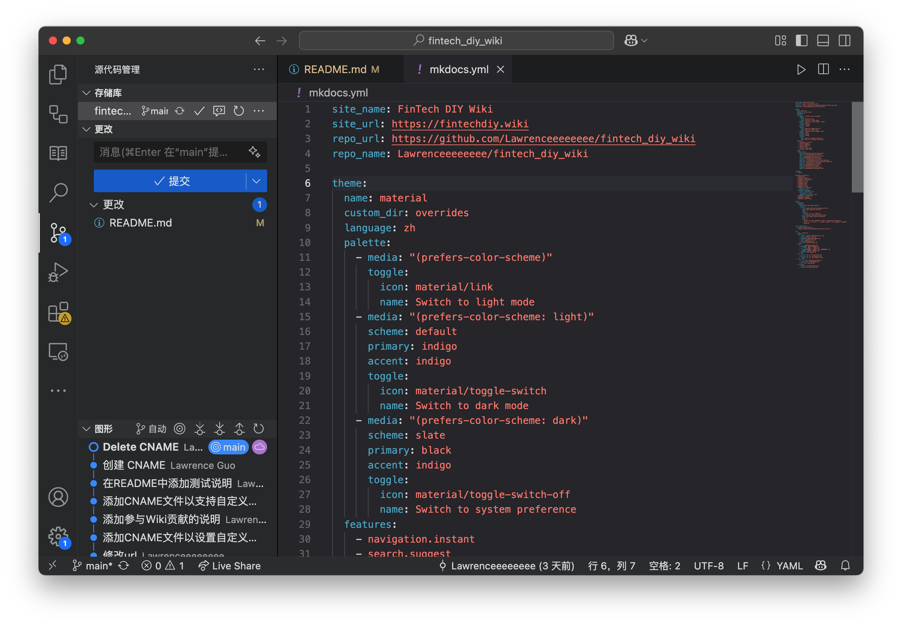

# Git & Github

虽然说Git在计算机科学里用的很多，但是完全可以推广到所有文本类的工程（包括软件开发、论文撰写）。尤其是在大学里会有很多小组作业、大作业、竞赛之类的东西，用Git进行协作开发其实能够做到事半功倍，远比在微信群里来回传文件要高效得多。

推荐学习资料：

[Git 工作流程 | 菜鸟教程](https://www.runoob.com/git/git-workflow.html)

[关于 GitHub 和 Git](https://docs.github.com/zh/get-started/start-your-journey/about-github-and-git)

[GitHub 快速入门课程](https://www.github-zh.com/getting-started/introduction-to-github)

## 为什么你需要Git？

想象一下这些场景：

- 写论文时保存了"终稿"、"最最终稿"、"打死不改稿"等20个版本
- 小组作业中A同学改动了B同学写的部分却没说改了哪里
- 需要找回三周前删除的一段精彩内容
- 想同时尝试两种不同的方案又怕搞乱原文件

Git正是为解决这些问题而生！它能：
✅ 自动记录每次修改内容
✅ 方便多人协作不冲突
✅ 随时回退到任意历史版本
✅ 支持并行开发不同功能

## Git核心概念

### 1. 仓库（Repository）

就像项目的专属文件夹，但能记住所有修改历史。新建项目时创建一个仓库即可。

### 2. 提交（Commit）

给当前版本拍张"快照"，需要填写说明（如"添加实验数据图表"）。建议每完成一个小功能就提交一次。

### 3. 分支（Branch）

主分支（main）像正式报告，可以新建分支（如"数据分析方案B"）做实验性修改，成功后再合并到主分支。

## 常用操作（命令行示例）

```bash
# 初始化仓库（在项目文件夹中执行）
git init

# 添加文件到暂存区（准备存快照）
git add 论文.doc

# 提交版本（写清楚修改内容）
git commit -m "添加第三章文献综述"

# 查看修改记录
git log

# 回退到指定版本（前7位版本号）
git checkout d3f4a7b

# 创建新分支
git branch 图表优化

# 合并分支到当前分支
git merge 图表优化

```

## GitHub：云端协作平台

### 1. 基础认知

- GitHub是Git的云端存储服务之一（类似网盘+协作平台）
- 注册地址：[github.com](http://github.com/)

### 2. 关键操作

```bash
# 将本地仓库关联到GitHub
git remote add origin [你的仓库地址]

# 上传本地内容
git push -u origin main

# 下载云端最新版本
git pull

# 克隆已有项目（小组作业常用）
git clone [仓库地址]

```

## 协作流程示例（小组论文写作）

1. 组长创建GitHub仓库，邀请组员加入
2. 每人克隆仓库到本地：
`git clone <https://github.com/xxx/毕业论文.git`>
3. 小明负责摘要部分：
    - 创建分支：`git branch xiaoming-abstract`
    - 切换分支：`git checkout xiaoming-abstract`
    - 完成修改后提交并推送到云端
4. 组长审查后合并到主分支
5. 所有人执行 `git pull` 获取最新版本

## 常见问题处理

### 文件冲突解决

当多人修改同一文件时，Git会提示冲突：

```
<<<<<<< HEAD
这是你修改的内容
=======
这是别人修改的内容
>>>>>>>

```

用文本编辑器手动选择保留的内容，删除标记符号后重新提交即可

如果弄不明白也没有关系，现在的IDE里自带Git的图形化界面，根据指引处理即可

## 推荐工具



我知道很多人看到要在命令行里写指令觉得很费劲，其实在实际操作的时候，很多常用操作是不需要写指令的，大部分代码编辑器都会有图形化界面帮你快速处理。比如说Visual Studio Code，在左侧的工具栏里有“源代码管理”，你可以很轻松地提交更改，编写提交消息、拉取最新内容。只有在遇到冲突的时候才需要用到命令行指令，但并不困难。

推荐使用以下工具（任选其一即可

1. Visual Studio Code内置Git功能
2. GitHub Desktop（图形化界面）
3. 网页版GitHub直接编辑

## 入门建议

1. 从个人项目开始练习（如课程论文、小的代码项目）
2. 每次提交写清楚修改说明
3. 重要文件提前备份
4. 善用`.gitignore`文件排除临时文件

开始可能会有点挑战，但一旦掌握这个技能，你会发现：

- 再也不用满屏找"最新版"文件
- 组员修改内容清晰可见
- 实验性修改可以大胆尝试
- 所有历史版本随时可取

附：Git指令速查表

```
提交三部曲：add → commit → push
更新两步走：pull → 开始工作
分支管理：branch → checkout → merge
紧急回退：checkout [版本号]

```